# The Tech Guy LMS — Database Schema

All tables use the `LMS_` prefix. Primary keys are UUIDs (`uuid_generate_v4()`). The schema is defined in `supabase/migrations/001_initial_schema.sql`.

## Entity Relationship Diagram

```mermaid
erDiagram
    LMS_organizations ||--o{ LMS_user_organizations : has
    LMS_users ||--o{ LMS_user_organizations : belongs
    LMS_roles ||--o{ LMS_user_organizations : assigns
    LMS_roles ||--o{ LMS_role_permissions : has
    LMS_permissions ||--o{ LMS_role_permissions : grants

    LMS_users ||--o{ LMS_sessions : has
    LMS_users ||--o{ LMS_password_reset_tokens : has
    LMS_users ||--o{ LMS_email_verification_tokens : has
    LMS_users ||--o| LMS_onboarding_progress : tracks

    LMS_organizations ||--o{ LMS_courses : owns
    LMS_users ||--o{ LMS_courses : instructs
    LMS_categories ||--o{ LMS_courses : categorizes
    LMS_categories ||--o{ LMS_categories : parent
    LMS_courses ||--o{ LMS_course_tags : tagged
    LMS_tags ||--o{ LMS_course_tags : applied
    LMS_courses ||--o{ LMS_modules : contains
    LMS_modules ||--o{ LMS_lessons : contains

    LMS_courses ||--o{ LMS_course_enrollments : enrolled
    LMS_users ||--o{ LMS_course_enrollments : enrolls
    LMS_users ||--o{ LMS_lesson_progress : tracks
    LMS_lessons ||--o{ LMS_lesson_progress : progress
    LMS_users ||--o{ LMS_bookmarks : saves
    LMS_lessons ||--o{ LMS_bookmarks : bookmarked
    LMS_users ||--o{ LMS_lesson_notes : writes
    LMS_lessons ||--o{ LMS_lesson_notes : noted
    LMS_users ||--o{ LMS_certificates : earns
    LMS_courses ||--o{ LMS_certificates : certifies

    LMS_courses ||--o{ LMS_live_classes : hosts
    LMS_users ||--o{ LMS_live_classes : teaches
    LMS_live_classes ||--o{ LMS_live_attendance : attended
    LMS_users ||--o{ LMS_live_attendance : attends

    LMS_courses ||--o{ LMS_quizzes : has
    LMS_quizzes ||--o{ LMS_quiz_questions : contains
    LMS_quizzes ||--o{ LMS_quiz_attempts : attempted
    LMS_users ||--o{ LMS_quiz_attempts : takes

    LMS_courses ||--o{ LMS_assignments : has
    LMS_assignments ||--o{ LMS_submissions : receives
    LMS_users ||--o{ LMS_submissions : submits

    LMS_courses ||--o{ LMS_projects : has
    LMS_projects ||--o{ LMS_project_submissions : receives
    LMS_users ||--o{ LMS_project_submissions : submits

    LMS_organizations ||--o{ LMS_communities : has
    LMS_communities ||--o{ LMS_posts : contains
    LMS_users ||--o{ LMS_posts : authors
    LMS_posts ||--o{ LMS_comments : has
    LMS_users ||--o{ LMS_comments : writes
    LMS_users ||--o{ LMS_reactions : reacts

    LMS_users ||--o{ LMS_xp : earns
    LMS_badges ||--o{ LMS_user_badges : awarded
    LMS_users ||--o{ LMS_user_badges : earns
    LMS_users ||--o| LMS_user_streaks : maintains
    LMS_users ||--o{ LMS_rewards : redeems

    LMS_users ||--o{ LMS_resumes : has
    LMS_users ||--o{ LMS_job_applications : applies
    LMS_users ||--o{ LMS_interviews : schedules

    LMS_users ||--o{ LMS_learning_roadmaps : owns
    LMS_users ||--o{ LMS_mentor_sessions : mentors
    LMS_users ||--o{ LMS_mentor_sessions : students
    LMS_mentor_sessions ||--o{ LMS_mentor_reviews : reviewed

    LMS_users ||--o{ LMS_conversations : creates
    LMS_conversations ||--o{ LMS_conversation_participants : has
    LMS_users ||--o{ LMS_conversation_participants : joins
    LMS_conversations ||--o{ LMS_messages : contains
    LMS_users ||--o{ LMS_messages : sends

    LMS_users ||--o{ LMS_notifications : receives
    LMS_users ||--o| LMS_notification_preferences : configures

    LMS_users ||--o{ LMS_ai_conversations : has
    LMS_users ||--o{ LMS_ai_recommendations : receives

    LMS_users ||--o{ LMS_audit_logs : triggers
    LMS_users ||--o{ LMS_subscriptions : subscribes
    LMS_organizations ||--o{ LMS_subscriptions : org_plan
    LMS_subscriptions ||--o{ LMS_payments : paid
    LMS_users ||--o{ LMS_payments : makes
    LMS_subscriptions ||--o{ LMS_invoices : billed
    LMS_users ||--o{ LMS_invoices : receives

    LMS_users ||--o{ LMS_api_keys : owns
    LMS_users ||--o{ LMS_connected_accounts : links
    LMS_users ||--o{ LMS_support_tickets : opens
    LMS_users ||--o{ LMS_support_tickets : assigned

    LMS_organizations {
        uuid id PK
        string name
        string slug UK
        string plan
        jsonb settings
    }

    LMS_users {
        uuid id PK
        string email UK
        string role
        string status
        boolean onboarding_completed
    }

    LMS_courses {
        uuid id PK
        uuid organization_id FK
        uuid instructor_id FK
        string title
        string slug
        string status
        decimal price
    }

    LMS_course_enrollments {
        uuid id PK
        uuid course_id FK
        uuid user_id FK
        decimal progress
    }

    LMS_modules {
        uuid id PK
        uuid course_id FK
        string title
    }

    LMS_lessons {
        uuid id PK
        uuid module_id FK
        string type
    }

    LMS_mentor_sessions {
        uuid id PK
        uuid mentor_id FK
        uuid student_id FK
        timestamptz scheduled_at
        string status
    }

    LMS_notifications {
        uuid id PK
        uuid user_id FK
        string type
        boolean is_read
    }

    LMS_payments {
        uuid id PK
        uuid user_id FK
        decimal amount
        string status
    }
```



## Table Index (58 tables)

| Domain | Tables |
|--------|--------|
| **Core** | `LMS_organizations`, `LMS_roles`, `LMS_permissions`, `LMS_role_permissions` |
| **Auth & users** | `LMS_users`, `LMS_user_organizations`, `LMS_sessions`, `LMS_password_reset_tokens`, `LMS_email_verification_tokens`, `LMS_onboarding_progress` |
| **Courses** | `LMS_categories`, `LMS_tags`, `LMS_courses`, `LMS_course_tags`, `LMS_modules`, `LMS_lessons`, `LMS_course_enrollments`, `LMS_lesson_progress`, `LMS_bookmarks`, `LMS_lesson_notes`, `LMS_certificates` |
| **Live & assessment** | `LMS_live_classes`, `LMS_live_attendance`, `LMS_quizzes`, `LMS_quiz_questions`, `LMS_quiz_attempts`, `LMS_assignments`, `LMS_submissions` |
| **Projects** | `LMS_projects`, `LMS_project_submissions` |
| **Community** | `LMS_communities`, `LMS_posts`, `LMS_comments`, `LMS_reactions` |
| **Gamification** | `LMS_xp`, `LMS_badges`, `LMS_user_badges`, `LMS_levels`, `LMS_rewards`, `LMS_user_streaks` |
| **Career** | `LMS_resumes`, `LMS_job_applications`, `LMS_interviews`, `LMS_learning_roadmaps` |
| **Mentorship** | `LMS_mentor_sessions`, `LMS_mentor_reviews` |
| **Messaging** | `LMS_conversations`, `LMS_conversation_participants`, `LMS_messages` |
| **Notifications** | `LMS_notifications`, `LMS_notification_preferences` |
| **AI** | `LMS_ai_conversations`, `LMS_ai_recommendations` |
| **Admin & billing** | `LMS_audit_logs`, `LMS_subscriptions`, `LMS_payments`, `LMS_coupons`, `LMS_invoices`, `LMS_api_keys`, `LMS_connected_accounts`, `LMS_support_tickets`, `LMS_system_settings` |

## Key relationships

- **Multi-tenancy**: Users join organizations via `LMS_user_organizations` with optional `LMS_roles` per org.
- **Course hierarchy**: `LMS_courses` → `LMS_modules` → `LMS_lessons`; enrollments link users to courses.
- **Mentorship**: `LMS_mentor_sessions` connects mentor and student users; reviews reference sessions.
- **Billing**: `LMS_subscriptions` tie users (and optionally orgs) to plans; `LMS_payments` and `LMS_invoices` record transactions.

## Migrations & seed

```bash
# Apply schema (Supabase SQL editor or CLI)
supabase db push

# Seed demo data
npm run db:seed
```

Seed data lives in `supabase/seed.sql`.
